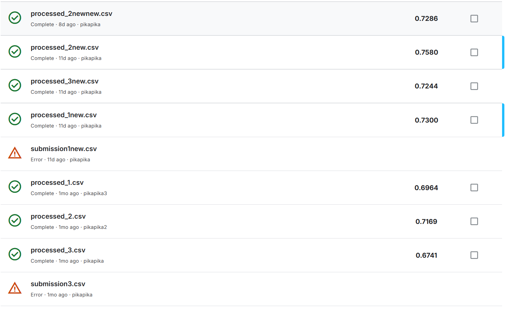

## Stone Classification

### 1.项目内容

**任务目标**：基于 PyTorch 深度学习框架对岩石图像进行分类。

**数据内容及类型**：该数据集包含超过 22 万张带注释的图像，涵盖 3 个父类和超过 2万个子类。在本项目中，我们主要关注父类的分类。

**模型：** Lenet、Resnet18、Vit、Efficientnet

**模型结果：**

**Lenet**：0.3333

**Resnet18**：0.6964->0.7300

**Vit**：0.6741->0.7244

**Efficientnet**：0.7169->0.7580->0.7286



### 2.代码实现

首先需要安装所需的包，在requirements中:

```python
pip install -r requirements.txt
```

最终的最优结果为Efficientnet增加预训练之后，直接运行Efficientnet.ipynb即可（不是Efficientnet_new.ipynb，该代码使用了高斯噪声准确率反而下降），将会生成一个submission.csv文件，请注意这个文件的格式有问题，请使用数据处理.ipynb将其转化成processed.csv文件之后方可上传。

### 3.最优结果

如需直接上传验证最优结果，我们的最优模型结果保存在/实验结果/processed_2new.csv，直接上传即可。

### 4.数据分析

如需对生成的训练损失验证损失进行画图，可直接参考数据分析.ipynb进行画图，我们的图像也都在该文件中生成。
